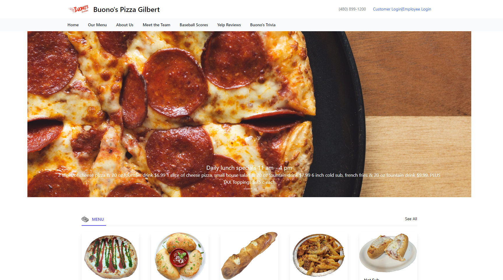
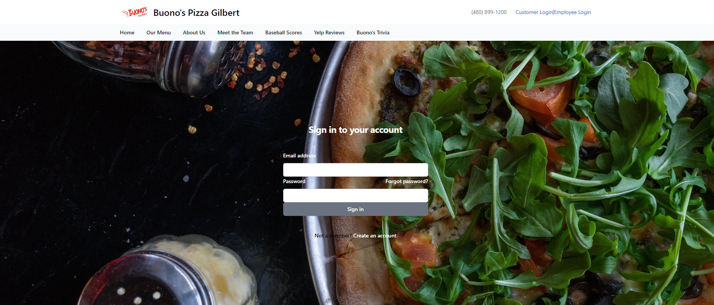
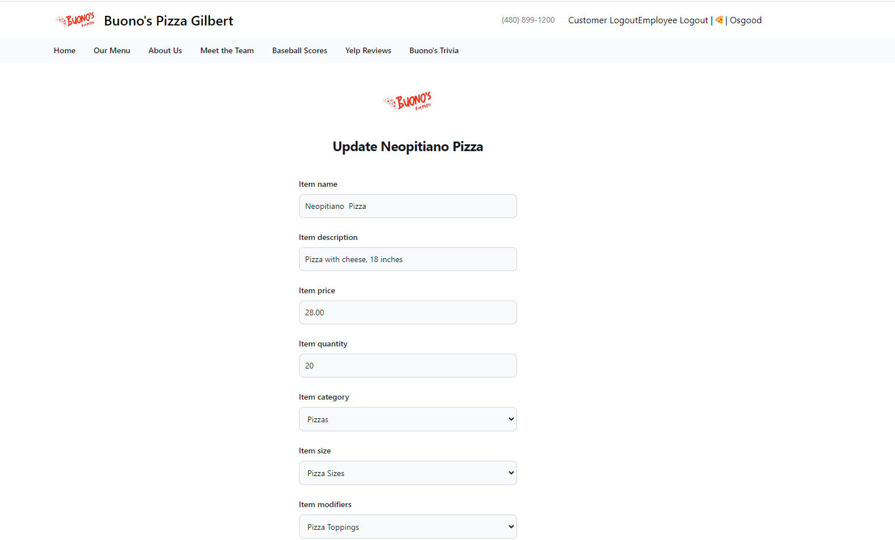
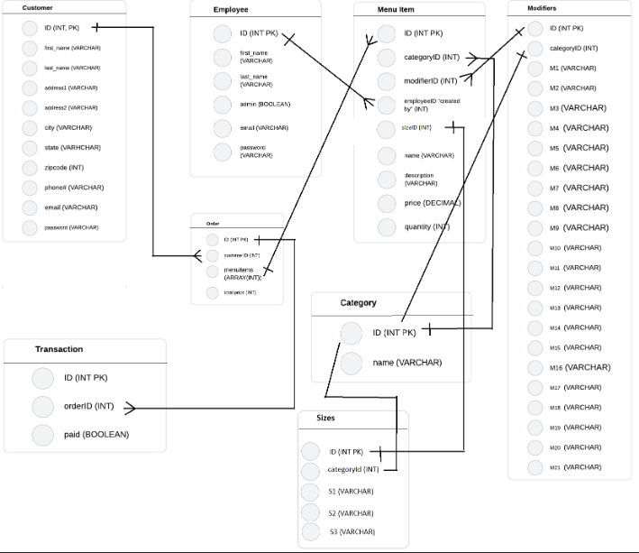

# Buonos Pizza Gilbert
    
  ## License
   
 
  (https://www.gnu.org/licenses/gpl-3.0)

  ## Description
  - Customers are able to easily Browse the Menu by category, 
  - Customers are able to create any account and add items to their cart (W.I.P)
  - Customer are able to customized their pizza or any other category menu by adding toppings, sides, dressing, etc.
  - Employe Admin Login. Role: Add, remove, edit items, images, etc.
  - To Re-create a functional and more modern
	Website for a real client.

  ## Table of Contents
  - [License](#license)
  - [Installation](#installation)
  - [Contribution](#contribution)
  - [Test](#test)
  - [Badges](#badges)
  - [Features](#features)

  ## Installation
  - Clone: https://github.com//Buonos Pizza Gilbert
  - Github: https://github.com/jeremiahmiranda79/Buonos-Pizza-Official 
  - Webpage: https://buonos-pizza-gilbert-b8cca8c50f8c.herokuapp.com/ 

  ## Contribution
  I used my README.md file generator to create this README.md 😉

  GitHub: https://github.com/jeremiahmiranda79/Pro-README-FILE-Generator

 - John Owen: Back developer and Data base manager
 - Jeremiah Miranda: Project manager 
 - Charbel Kamar: Front and backend developer
 - Paloma Najera: Front end developer

  ## Test
  test here: https://buonos-pizza-gilbert-b8cca8c50f8c.herokuapp.com/

  ## Badges
         

  ## Features
  - Home page
  
  - Login page
  
  - Admin Page
  
  - ERD
  